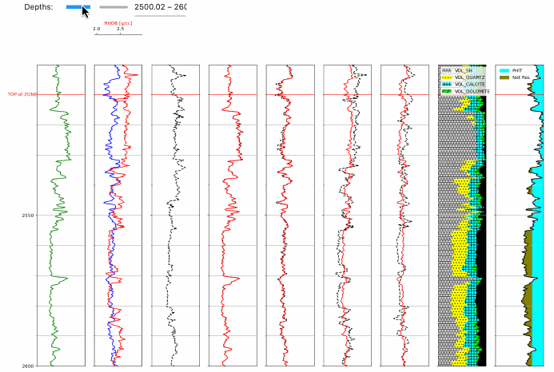

# petrophysical_evaluation_optimization_methods

We came across an optimization method developed by Ruben Charles, which can be found on LinkedIn and in his GitHub repository. This method is designed to estimate the lithology fractions of rocks by utilizing probabilistic mineralogical solutions.

Ruben has presented a minimalist approach in this method, primarily focusing on testing the capabilities of Python, SciPy, and Matplotlib. We encourage you to explore our accompanying notebook and experiment with it.

We found Ruben's optimization method intriguing and valuable, leading us to make a few enhancements to his code in our own fork of his GitHub repository. The changes we made include:

1.	Automatically computing what Ruben refers to as "magical numbers." These numbers normalize the magnitudes of each log curve, ensuring equal weighting in the optimization process.
2.	Utilizing Jupyter Notebook's Python Widgets to create a slider that allows interactive adjustment of the depth plot within a discrete depth range. This feature can be particularly useful for generating depth plots at specific scales using Matplotlib.
3.	Incorporating additional tops into the depth plots to demonstrate how tops can be effectively utilized.

Our next step involves enabling the user to select the desired log curves using a Jupyter Notebook checkbox widget. This enhancement will provide more flexibility in curve selection, allowing users to eliminate certain log curves (e.g., RHOB) under poor hole conditions.

Our newest Jupyter Notebook can be found at this site which, again is a fork of Ruben's original repository. 

