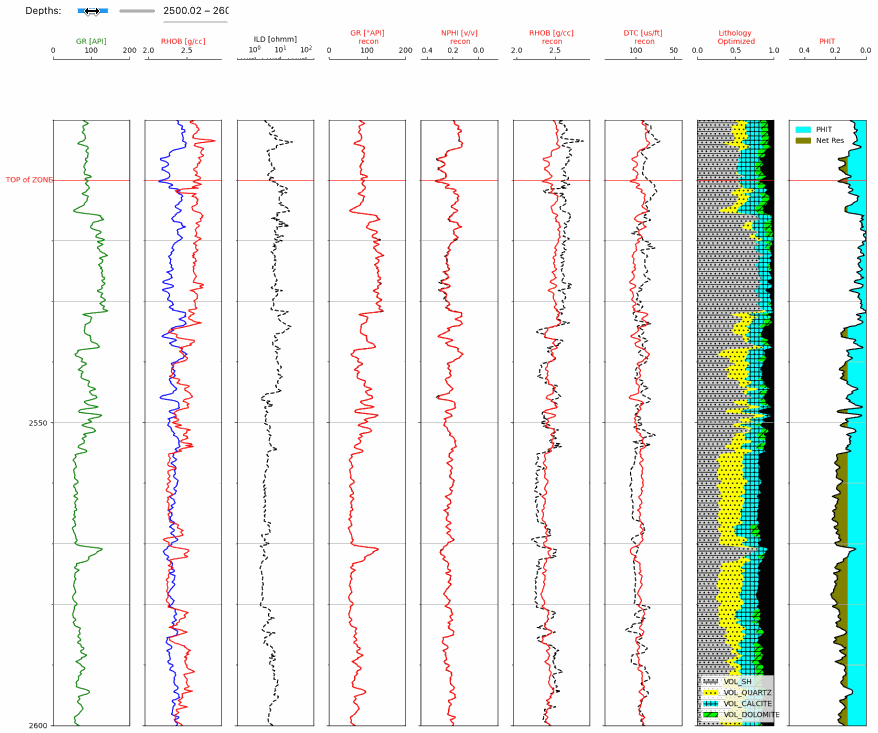

# petrophysical_evaluation_optimization_methods

We came across an optimization method developed by Ruben Charles, which can be found on LinkedIn and in his GitHub repository. This method is designed to estimate the lithology fractions of rocks by utilizing probabilistic mineralogical solutions.

Ruben has presented a minimalist approach in this method, primarily focusing on testing the capabilities of Python, SciPy, and Matplotlib. We encourage you to explore our accompanying notebook and experiment with it.As usual, simplicity is the best desigh.

We found Ruben's optimization method intriguing and valuable, leading us to make a few enhancements to his code in our own fork of his GitHub repository. The changes we made include:

    1  The User can now select the logging tools they want to use for the optimization.
    2  Using the same logic we can also turn off the Bulk Density tool in badhole conditions.
    3 In the process we automatically computing what Ruben refers to as "magical numbers." These numbers normalize the magnitudes of each log curve, ensuring equal weighting in the optimization process.
    4 Utilizing Jupyter Notebook's Python Widgets to create a slider, we can interactively adjustment of the depth plot within a discrete depth range. This feature can be particularly useful for generating depth plots at specific log scales using Matplotlib and allowing for scrolling through the data. 
 

Use the **petrophysical_evaluation_optimization_methods_Final.ipynb** notebook where you can select the log curves that you want to use in the optimization process. 

Our next step involves enabling the user to select the desired log curves using a Jupyter Notebook checkbox widget. This enhancement will provide more flexibility in curve selection, allowing users to eliminate certain log curves (e.g., RHOB) under poor hole conditions.

Our newest Jupyter Notebook can be found at this site which, again is a fork of Ruben's original repository. Thanks Ruben for giving us a great start.

